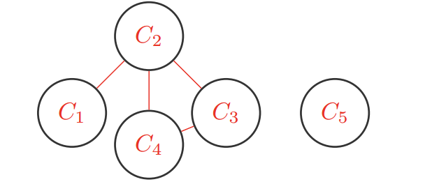

# Regular Discussion 3 

## 1. CSPs: Trapped Pacman

(a)
Binary:
$X_1$  or $X_2 = P$, $X_2 $ or $X_3 = E$
$X_3$ or $X_4 = E$, $X_4$ or $X_5 = P$
$X_5$ or $X_6 = P$, $X_6$ or $X_1 = P$
$\forall i,j \text{ s.t. } neighbor(i,j)\neg (X_i \text{ and } X_j = E)$
Unary:
$X_2 \not ={P}$, $X_3 \not ={P}$ $X_4 \not ={P}$

(b)
$X_1 = E, X_2 = None$ Since $X_2$ is run out of possibility, no need to continue.

(c)
According to MRV(minimum remaining value), we should choose the value has minimum remaining domain next, so choose $X_1$ or $X_5$

(d)
(P,E,G,E,P,G)
(P,G,E,G,P,G)

## 2. Course Scheduling

(a)
$
C_1 \{A,C \} \\
C_2 \{A \} \\
C_3 \{B,C \} \\
C_4 \{B,C\} \\
C_5 \{A,B \} \\
C_1 \neq C_2, C_2 \neq C_3, C_2 \neq C_4, C_3\ neq C_4
$

(b)
  

