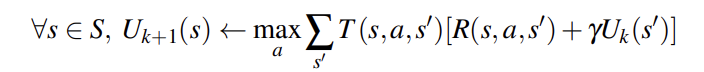
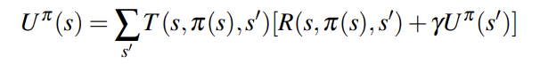
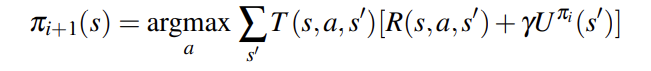
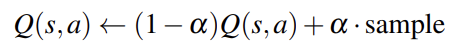
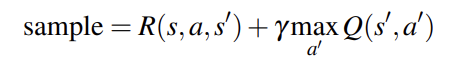

# Regular Discussion 5

## 1. MDPs: Micro-Blackjack

(a)
Total States = {0,2,3,4,5,DONE}
Total actions = {Draw, Stop}
Card = {2,3,4}

**The transition function $T(s,action,s')$:**
$T(s,Stop,DONE) = 1$
$T(0,Draw,s') = 1/3, s'\in \{2,3,4\}$
$T(2,Draw,s') = 1/3, s\in \{4,5,DONE\}$
$T(3,Draw,5) = 1/3, T(3,Draw,DONE) = 2/3$
$T(4,Draw,DONE) = 1$
$T(5,Draw,DONE) = 1$
$\text{else } T =0$

**The reward function $R(s,action,s')$:**
$R(s,Stop,DONE) = s, s\in{2,3,4,5}$
$\text{else } R = 0$

(b)

$V_{k+1}(s)= \underset{a}{max} \underset{s'}{\sum} T(s,a,s') [R(s,a,s')+ \gamma V_k(s')]$
$\Rightarrow$
$V_k(0) = \frac{1}{3}\cdot [V_{k-1}(2)+V_{k-1}(3)+V_{k-1}(4)]$
$V_k(2) = max(2,\frac{1}{3}\cdot [V_{k-1}(4)+V_{k-1}(5)])$
$V_k(3) = max(3,\frac{1}{3}\cdot V_{k-1}(5))$
$V_k(4) = 4$
$V_k(5) = 5$
| States            | 0     | 2     | 3     | 4     | 5     |
| :---------------- | :----:| :----:| :----:| :----:| :----:|
| $V_0$             | 0 | 0 | 0 | 0 | 0 |
| $V_1$             | 0 | 2 | 3 | 4 | 5 |
| $V_2$             | 3 | 3 | 3 | 4 | 5 |
| $V_3$             | $\frac{10}{3}$ | 3 | 3 | 4 | 5 |
| $V_4$             | $\frac{10}{3}$ | 3 | 3 | 4 | 5 |

(c)
| States            | 0     | 2     | 3     | 4     | 5     |
| :---------------- | :----:| :----:| :----:| :----:| :----:|
| $\pi ^ *$         | Draw | Draw | Stop | Stop | Stop |

(d)

| States            | 0     | 2     | 3     | 4     | 5     |
| :---------------- | :----:| :----:| :----:| :----:| :----:|
| $\pi ^ *$         | Draw | Stop | Draw | Stop | Draw |
| $V^{\pi_{i}}$     | 2 | 2 | 0 | 4 | 0 |
| $\pi_{i+1}$       | Draw |Stop |Stop | Stop | Stop |

  

$V^\pi (s)= \underset{s'}{\sum} T(s,\pi,s') [R(s,\pi,s')+ \gamma V^\pi(s')]$
$\Rightarrow$
$$
\left\{
\begin{aligned}
V^{\pi}(0) &=\frac{1}{3}\cdot(V^\pi(2)+V^\pi(3)+V^\pi(4)) = 2 \\
V^{\pi}(2) &= 2 \\
V^{\pi}(3) &=\frac{1}{3}\cdot V^\pi(5) = 0 \\
V^{\pi}(4) &= 4 \\
V^{\pi}(5) &= 0 \\
\end{aligned}
\right.
$$

  
$\pi_{i+1}(s) = \underset{a}{argmax} \underset{s'}{\sum} T(s,a,s') [R(s,a,s')+\gamma V^{\pi_i}(s')]$
$\Rightarrow$
$$
\left\{
\begin{aligned}
\pi_{i+1}(0) &= argmax(Draw\rightarrow2,Stop\rightarrow0) = Draw \\
\pi_{i+1}(2) &= argmax(Draw\rightarrow\frac{4}{3}, Stop\rightarrow2) = Stop \\
\pi_{i+1}(3) &= argmax(Draw\rightarrow0, Stop\rightarrow3) = Stop \\
\pi_{i+1}(4) &= argmax(Draw\rightarrow0, Stop\rightarrow4) = Stop \\
\pi_{i+1}(5) &= argmax(Draw\rightarrow0, Stop\rightarrow5) = Stop \\
\end{aligned}
\right.
$$

## 2. MDPs: Grid-World Water Park

(a)
We total have 14 squares, 3 of them we don't have choice, so we left 11, each we have 2 choices, so $2^{11}$

(b)
|             | $\gamma$     | s=A     | s=E     |
| :---------------- | :----:| :----:| :----:|
| $V_3(s)$             | 1.0 | 0 | 4 |
| $V_{10}(s)$          | 1.0 | 2 | 4 |
| $V_{10}(s)$          | 0.1 | 0 | 2.2 |
| $Q_1(s,west)$        | 1.0 | -- | 0 |
| $Q_{10}(s,west)$     | 1.0 | -- | 3 |
| $V^*(s)$             | 1.0 | $\infty$ | $\infty$  |
| $V^*(s)$             | 0,1 | 0 | 2.2 |

(c)
**Q_learning:** this is RL problem
  
  

$\alpha = 0.5, \gamma = 1$

|             | $Q(D,west)$     | $Q(D,east)$     | $Q(E,west)$ | $Q(E,east)$ |compute|
| :---------------- | :----:| :----:| :----:| :----:|:----:|
| Initial:             | 0 | 0 | 0 | 0 |--|
| Transition1: $(s=D,a=east,r=-1,s'=E)$ | |-0.5| |  |$=(1-0.5)*0+0.5*(-1+0)$ |
| Transition2: $(s=E,a=east,r=+2,s'=F)$ | | | |1 |$=0.5*0+0.5(2+0)$ |
| Transition3: $(s=D,a=west,r=0,s'=D)$  | 0| | |  |$=0.5*0+0.5*(0+max[0,-0.5]$)
| Transition4: $(s=D,a=east,r=-1,s'=E)$ | | -0.25| |  |$=0.5*-0.5+0.5(-1+max[0,1])$|