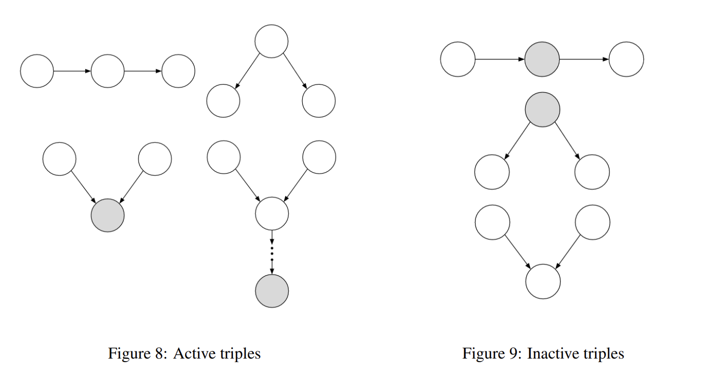
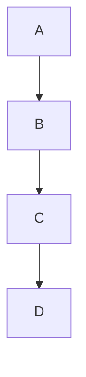
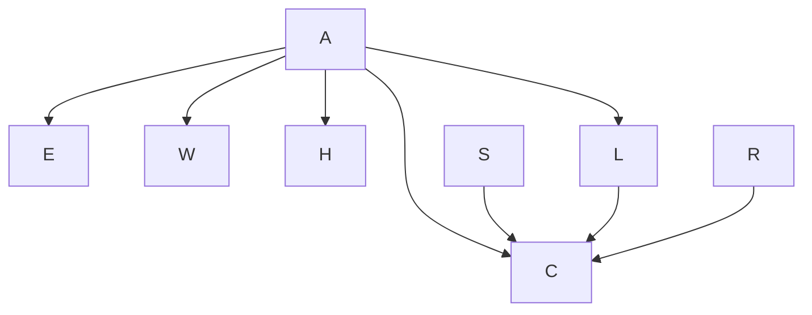
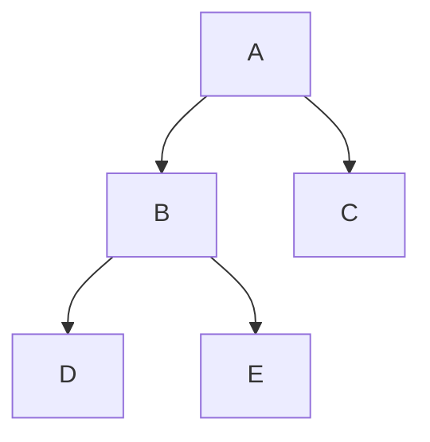

# Regular Discussion 8

$ $

## 1 Bayes’ Nets Representation and Probability

(a)
$P(+g, +a, +b, +s)$ this can be easily compute from Bayes net tables:
$ = P(+g) \cdot P(+a,+g) \cdot P(+b) \cdot P(+s,+a,+b) = 0.1*1.0*0.4*1.0 = 0.04$

(b)
$P(+a) = P(+a, +g) + p(+a, -g) = 0.1*1.0 + 0.9*0.1 = 0.19$

(c)
since $\newcommand{\indep}{\perp \!\!\! \perp} a \indep b$
$\therefore P(+a, +b) = P(+a) = 0.19$

(d)
$P(+a|+s,+b) = \dfrac{P(+a,+b,+s)}{P(+s,+b)} = \dfrac{P(+a,+b,+s)}{P(+a,+b,+s)+ P(-a,+b,+s)} = \dfrac{P(+a) \cdot P(+b) \cdot P(+s| +a,+b)}{P(+a) \cdot P(+b) \cdot P(+s| +a,+b) + P(-a) \cdot P(+b) \cdot P(+s| -a,+b)} = \dfrac{0.19*0.4*1.0}{0.19*0.4*1.0 + 0.81*0.4*0.8} = 0.2267$

(e)
$P(+g|+a) = \dfrac{P(+g,+a)}{P(+a)} = \dfrac{P(+g) \cdot P(+a|+g)}{P(+a)} = \dfrac{0.1*1.0}{0.19} = 0.5263$

(f) since $\newcommand{\indep}{\perp \!\!\! \perp} g \indep b$
$P(+g|+b) = P(+g) = 0.1$

## 2. Bayes Nets: Representation 

(a)
In this Bayes net:
$P(A,B,C,D,E,F,G) = P(A)\cdot P(C|A) \cdot P(B|A) \cdot P(D|B) \cdot P(E) \cdot P(F|D,E) \cdot P(G|D)$

(b)
$A:4, D:16, F:64$

(c)
Use  **d-separation** algorithm:

* 1. Shade all observed nodes in the graph.
  2. Enumerate all undirected paths from X to Y.
  3. For each path:
        a. Decompose the path into triples (segments of 3 nodes).
        b. If all triples are active, this path is active and d-connects X to Y
  4. If no path d-connects X and Y, then X and Y are d-separated, so they are       conditionally independent given {Z1,...,Zk}

  

1. For $B,C$, there is a path $C\leftarrow A \rightarrow B$ this is active, so not independent.
2. For $F,G$, given $D$, there is a path $F\leftarrow D \rightarrow G$ this is Inactive when D is evidence, so $\newcommand{\indep}{\perp \!\!\! \perp} F \indep G | D$
3. For $A,F$, there is a path $A \rightarrow B \rightarrow D \rightarrow F$, the two triples inside are all active, so not independent.
4. For $B,F$, given $D$, there is a path $B \rightarrow D \rightarrow F$, this is Inactive, so $\newcommand{\indep}{\perp \!\!\! \perp} B \indep F | D$
5. For $D,E$, given $F$, there is a path $D \rightarrow F \leftarrow E$, this is active, so not independent
6. For $C,G$, there is a path $C \leftarrow A \rightarrow B \rightarrow D \rightarrow G$, for those three triples, they are all active, so not independent.
7. For $E,A$, given $D$, there is a path $A \rightarrow B \rightarrow D \rightarrow F \leftarrow E$, Inactive, so $\newcommand{\indep}{\perp \!\!\! \perp} E \indep A | D$
8. For $D,E$, there is a path $D \rightarrow F \leftarrow E$, Inactive, so $\newcommand{\indep}{\perp \!\!\! \perp} D \indep E $

(d)
According to the CPTs:

only $\newcommand{\indep}{\perp \!\!\! \perp} B \indep C$, cause in the B,C table, we can see that they are independent.

(e)
since $A$ influences $\{E, W, H, L, C\}$. $C$ is influenced by $\{A, S, L, R\}$.

## 3. Bayes Nets: Variable Elimination

According to the CPTs tables:

(a)
(i): $P(+b|+a) = 0.5$ this is in table.
(ii): $P(+a,+b) = (+b|+a)\cdot P(+a) = 0.5*0.25 = 0.125$
(iii): $P(+a|+b) = \dfrac{P(+a,+b)}{P(+b)} = \dfrac{P(+a,+b)}{P(+a,+b)+ P(-a,+b)} = \dfrac{0.125}{0.125+P(+b|-a)\cdot P(-a)} = \dfrac{0.125}{0.125+0.25*0.75} = 0.4$

(b)
**Variable Elimination:**
To eliminate a variable X, we:

* 1. Join (multiply together) all factors involving $X$.
* 2. Group by $X$ and sum out.

(i) The initial factors is all the table and remove all the combinations that contradict the evidence.
so $P(A), P(B|A), P(+c|A), P(D|B), P(E|B)$

(ii) (iii)
eliminate variable b, we join $P(B|A), P(D|B), P(E|B) \Rightarrow$
$f(A,D,E) = \sum_{B} P(B|A)\cdot P(D|B) \cdot P(E|B) = P(D,E|A)$

(iv)
| factor | Probability | size |
| ------ | ----------- | ---- |
| $f(A)$ | $P(A)$ | $2$ |
| $f(+c,A)$ | $P(+c\|A)$ | $2$ |
| $f(A,D,E)$ | $P(D,E\|A)$ | $2^3$ |

(v)
To get efficient elimination, each time eliminate should join as less factors as possible.
So eliminate $D \rightarrow E \rightarrow B$ or $E \rightarrow D \rightarrow B$

(vi)
just do normalization and get the value of (+a,-c).

