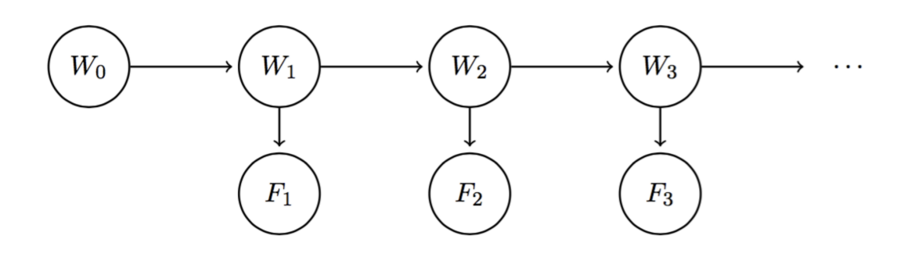

# Regular Discussion 10

## 1. HMMs

**Review:**

* *Hidden Markov Model:*
    
  $W_i$ state variable, $F_i$ evidence variable
* *Belief Distribution*: 
  $B(W_i) = P(W_i|f_1,\cdots.f_i)$, at time $i$ based on all evidence $F_1,\cdots ,F_i$ observed up to date
  $B'(W_i) = P(W_i|f_1,\cdots.f_{i-1})$ at time $i$ based on all evidence $F_1,\cdots ,F_{i-1}$ observed.
* *Forward Algorithm*:
  * 1. Prediction update: using our current belief distribution to get the estimate for the next belief state will be.
    $B'(W_{i+1}) = \underset{w_i}{\sum}P(W_{i+1}|w_i) \cdot B(w_i)$
  * 2. Observation update: include the new Observation $f_{i+1}$
    $B(W_{i+1}) \propto P(f_{i+1}|W_{i+1}) \cdot B'(W_{i+1})$
  * 3. Normalize the value, since in step 2 we compute using $\propto$
* *Particle Filtering*:  analog to Bayes’ net sampling, inorder to avoid computationally expensive running exact inference.
  * 1. Randomly initialize
  * 2. Prediction update on each Particle(sample from the $P(W_{i+1}|w_i)$)
  * 3. Observation update (weight each Particle by $P(f_i|w_i)$)
  * 4. Normalize and Resample or re-initialize if $\sum weight = 0$
    * i. Calculate the weights of all particles as described above.
    * ii. Calculate the total weight for each state.
    * iii. If the sum of all weights across all states is 0, reinitialize all particles.
    * iv. Else, normalize the distribution of total weights over states and resample your list of particles from this distribution.

(a) use link relation in HHM
$P(W_1, O_1 = a) = P(W_1) \cdot P(O_1 = a|W_1) = \left\{ \begin{aligned}
    0.3*0.9 = 0.27, W_1 = 0 \\
    0.7*0.5 = 0.35, W_1 = 1
\end{aligned}  \right.$

(b) the Prediction update
$P(W_2,O_1 = a) = \underset{w_1}{\sum}P(W_2|w_1)\cdot P(w_1, O_1 = a) \\ 
=\left\{\begin{aligned}
    P(W_2=0|w_1=0)\cdot P(w_1=0,O_1=a) + P(W_2=0|w_1=1)\cdot P(w_1=1,O_1=a) \\
    P(W_2=1|w_1=0)\cdot P(w_1=0,O_1=a) + P(W_2=1|w_1=1)\cdot P(w_1=1,O_1=a) \\
\end{aligned}
\right. \\  
=\left\{ \begin{aligned}
    0.4*0.27+0.8*0.35 \\
    0.6*0.27+0.2*0.35 
\end{aligned}
\right. \\
=\left\{ \begin{aligned}
    0.388, W_2 = 0 \\
    0.232, W_2 = 1
\end{aligned}
\right.
$

(c) the Observation update
$P(W_2,O_1=a,O_2=b) = P(O_2=b|W_2)\cdot P(W_2,O_1=a) \\
= \left\{\begin{aligned}
    P(O_2 = b | W_2 = 0) \cdot P(W_2 = 0,O_1=a) \\
    P(O_2 = b | W_2 = 1) \cdot P(W_2 = 1,O_1=a) 
\end{aligned}
\right. \\
= \left\{\begin{aligned}
    0.1*0.388 = 0.0388, W_2 = 0 \\
    0.5*0.232 = 0.116, W_2 = 1
\end{aligned}
\right.
$

(d) Normalize
$P(W_2|O_1=a,O_2=b) \propto P(W_2,O_1=a,O_2=b)\\
\underset{Normalize}{=}\left\{\begin{aligned}
    0.25, W_2 = 0 \\
    0.75, W_2 = 1
\end{aligned}
\right. 
$  

## 2. Particle Filtering 

(a) Observation update
$weight = P(O_1 = a|W_1)$
$\therefore \Rightarrow$
$weight_{P1} = P(O_1=a|W_1=0) = 0.9$
$weight_{P2} = P(O_1=a|W_1=1) = 0.5$

(b) Normalize and Resample
total weight = $0.9+0.5=1.4$
$
\left.
\begin{aligned}
\text{weight for state } 0 = 0.9  \\ 
\text{weight for state } 1 = 0.5
\end{aligned}
\right. \underset{Normalize}{\Rightarrow}
\left\{
\begin{aligned}
0.643 \\
0.357
\end{aligned}
\right.
$

For $P1$, the Random Number is $0.22 < 0.643$, $\Rightarrow$ state 0;
For $P2$, the Random Number is $0.05 < 0.643$, $\Rightarrow$ state 0;

(c) Prediction update
For $P1$, $P(nextState = 0|currState=0)=0.4,P(1|0)=0.6$, Random Number = $0.33 < 0.4, \Rightarrow $ state 0.
For $P2$, $P(nextState = 0|currState=0)=0.6,P(1|0)=0.6$, Random Number = $0.20 < 0.4, \Rightarrow $ state 0.

(d) Observation update
$weight = P(O_2 = b|W_2)$
$\therefore \Rightarrow$
$weight_{P1} = P(O_2=b|W_2=0) = 0.1$
$weight_{P2} = P(O_2=b|W_2=0) = 0.1$

(e) Normalize and Resample
total weight = $0.1+0.1=0.2$
$
\left.
\begin{aligned}
\text{weight for state } 0 &= 0.2  \\ 
\text{weight for state } 1 &= 0
\end{aligned}
\right. \underset{Normalize}{\Rightarrow}
\left\{
\begin{aligned}
1 \\
0
\end{aligned}
\right.
$

For $P1$, the Random Number is $0.84 < 1$, $\Rightarrow$ state 0;
For $P2$, the Random Number is $0.54 < 1$, $\Rightarrow$ state 0;

(f)
Since all particles is in state 0.
$P(W_2 = 0|O_1=a,O_2=b) = 1$
$P(W_2 = 1|O_1=a,O_2=b) = 0$

