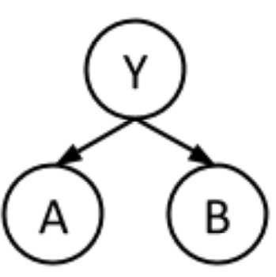

# Regular Discussion 11

## 1. Naive Bayes

1. maximum likelihood estimates
just count.

|$Y$| $P(Y)$|
| - | ----- |
| 0 | $6/10$|
| 1 |$4/10$ |

|$A$| $Y$| $P(A\|Y)$ |
| - | ----- | :--: |
|0 | 0 | $1/6$|
|1 | 0 | $5/6$|
|0 | 1 | $1/4$|
|1 | 1 | $3/4$|

|$B$| $Y$| $P(B\|Y)$ |
| - | ----- | :--: |
|0 | 0 | $2/6$|
|1 | 0 | $4/6$|
|0 | 1 | $1/4$|
|1 | 1 | $3/4$|

 

2. Consider a new data point (A = 1, B = 1). What label would this classifier assign to this sample?
Just simply do Bayes network compute.
$\begin{aligned}
prediction(f_1,\cdots,f_n) &= \underset{y}{argmax} P(Y=y|F_1=f_1,\cdots, F_N=f_n) \\
                    &= \underset{y}{argmax} P(Y=y,F_1=f_1,\cdots, F_N=f_n) \\
                    &= \underset{y}{argmax} P(Y=y) \prod_{i=1}^n P(Fi=fi|Y=y)
\end{aligned}$
$P(Y=0| A=1,B=1) = P(Y=0)P(A=1|Y=0)P(B=1|Y=0)=\frac{6}{10}\cdot\frac{5}{6}\cdot\frac{4}{6}=\frac{1}{3}$
$P(Y=1| A=1,B=1) = P(Y=1)P(A=1|Y=1)P(B=1|Y=1)=\frac{4}{10}\cdot\frac{3}{4}\cdot\frac{3}{4}=\frac{9}{40}$
$\therefore $ Our classifier will predict label 0.

3. Laplace Smoothing
then the Laplace estimate with strength $k$ is:
$N$ is the size of all sample.
$|X|$ is the different values of $x$ from a sample.
$$P_{LAP,k}(x)= \frac{count(x)+k}{N+k|X|}$$

|$A$| $Y$| $P(A\|Y)$ |
| - | ----- | :--: |
|0 | 0 | $\frac{1+2}{6+2\cdot2}=3/10$|
|1 | 0 | $\frac{5+2}{6+2\cdot2}=7/10$|
|0 | 1 | $\frac{1+2}{4+2\cdot2}=3/8$|
|1 | 1 | $\frac{3+2}{4+2\cdot2}=5/8$|

## 2. Perceptron

(a) 
The data are linearly separable.
(b)
**Updating weights:**
$w \leftarrow w + y^*f(x)$

$f(x) = [f_0,f_0,f_1] = [1,A,B]$

|step| Weight | features | Score | Correct |
| :-: | :-: | :-: | :-: |  :-: |
| 1 |[-1, 0, 0] | [1, 1, 1] | $w\cdot f = -1$ | true|
| 2 |[-1, 0, 0] | [1, 3, 2]| $w\cdot f = -1$ | false, $w = w+f \rightarrow $ [0, 3, 2]|
| 3 |[0, 3, 2] | [1, 2, 4] | $w\cdot f = 14$ | true|
| 3 |[0, 3, 2] | [1, 3, 4] | $w\cdot f = 17$ | true|
| 3 |[0, 3, 2] | [1, 2, 3] | $w\cdot f = 12$ | false, $w = w-f \rightarrow$ [-1, 1, -1] |

(c)
use current weight [-1, 1, -1]
we will incorrect predict data3 and data4 since:
$w\cdot f_3 = [-1,1,-1]\cdot[1,2,4] = -3 <0$
$w\cdot f_4 = [-1,1,-1]\cdot[1,3,4] = -2 <0$

(d)

1. means $A+B \geq 8 \rightarrow +$ so use $w = [-8,1,1]$
2. can't find such weight
3. can't classify since our Perceptron model use score rather than agree.
