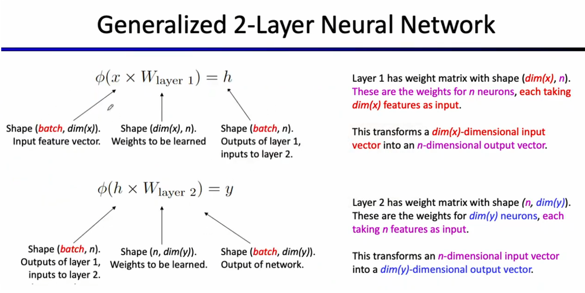
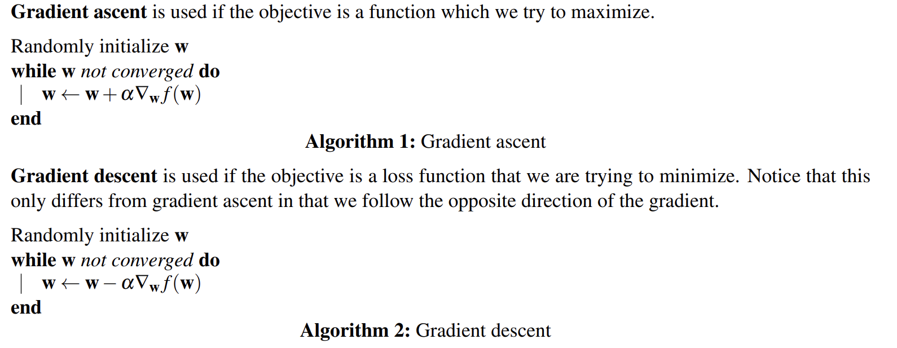

# Regular Discussion 12

## Review

### Size of neural network

  

### update in neural network

use learning rate $\alpha$ and gradient
  

## 1. Optimization

(a)
$s(\gamma) = \dfrac{1}{1+e^{-\gamma}} \Rightarrow s'(\gamma) = \dfrac{e^{-\gamma}}{(1 + e^{-\gamma})^2}$
$s(\gamma)(1-s(\gamma)) = \dfrac{1}{1+e^{-\gamma}} \cdot \dfrac{e^{-\gamma}}{1+e^{-\gamma}} = s'(\gamma)$

(b)
$$\because h(x) = s(\sum_{i}w_ix_i) \overset{\sum_{i}w_ix_i = \gamma}{\Rightarrow} s(\gamma)$$
$$\frac{ds(\gamma)}{dw_j} = \frac{ds(\gamma)}{d\gamma}\frac{d\gamma}{dw_j} = s'(y)x_j$$
$$\therefore L =  −[y \ln h(x) + (1 − y) \ln(1 − h(x))] =  −[y \ln s(\gamma) + (1 − y) \ln(1 − s(\gamma))]$$
$$\therefore \frac{dL}{dw_j} = -[y \frac{1}{s(\gamma)}s'(\gamma)x_j + (1-y)\frac{1}{1-s(\gamma)}(-s'(\gamma)x_j)]$$
$$\because s'(x) = s(x)(1-s(x))$$
$$\Rightarrow \frac{dL}{dw_j} = -x_j[y(1-s(\gamma)) -(1-y)s(w_j)] = x_j(-y+s(\gamma)) = x_j(-y+h(x)) $$

(c)
$$
\begin{aligned}
\nabla_wL &= [\frac{dL}{dw_1}, \frac{dL}{dw_2}, \cdots, \frac{dL}{dw_k}]^T \\
&= [x_1(-y+h(x)), x_2(-y+h(x)), \cdots, x_k(-y+h(x))]^T \\
&= [x_1,x_2,\cdots, x_k]^T(-y+h(x)) \\
&= -\boldsymbol{x}(-y+h(x))
\end{aligned}
$$

(d)
$w \leftarrow w + \eta\cdot \nabla_wL$

## 2. Neural Network Representations

1. $\because o = wx$, can only represent (a), with $w = 2$.
2. $\because o = wx+b$, can represent (a) with $w = 2, b =0$, represent (b) with $w=4,b=-5$
3. $\because o =\text{ReLu}(wx+b)$, With the output coming directly from the ReLU, this cannot produce any values less than zero. It can represent (c) with $w = 2, b = −5$, and (d) with $w = −2, b = −5$
4. $\because o = w_2(w_1x+b_1) + b_2 = wx+b$, with no non-linearity in between this is just a affine function with different coefficients. represent the same as 2.
5. $\because o = w_2(\text{ReLU}(w_1x+b_1)) +b_2$, The affine transformation after the ReLU is capable of stretching (or flipping) and shifting the ReLU output in the vertical dimension. So can represent (c), (d), (e)
6. (c), (d), (e), and (f). Note that (h) cannot be produced since its line has only one flat segment (and the affine layers can only scale, shift, and flip the graph in the vertical dimension; they can’t rotate the graph).
\
*All above neural network has hidden_layer_size = 1.*
*Below 7 and 8 hidden_layer_size = 2*
7. With no non-linearity, this reduces to a single affine function, so (a) and (b)
8. All functions except for (g)